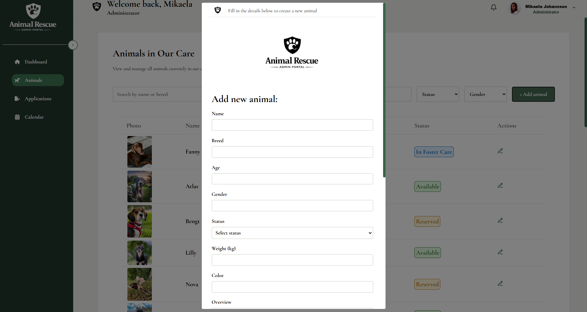
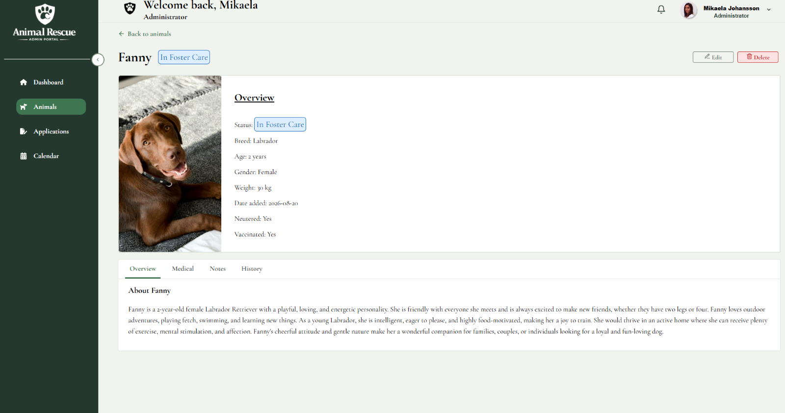
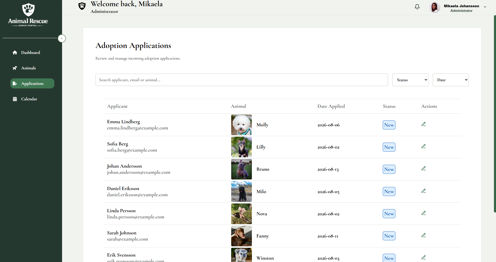
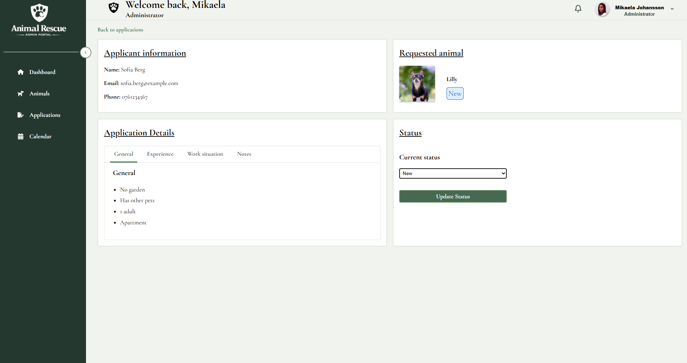
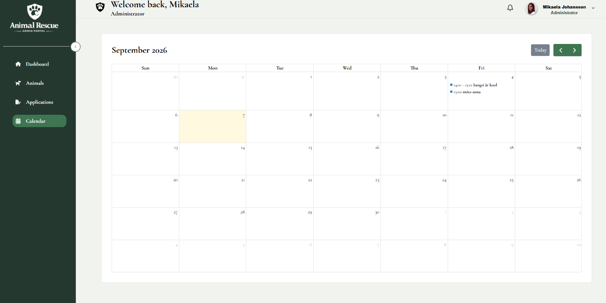
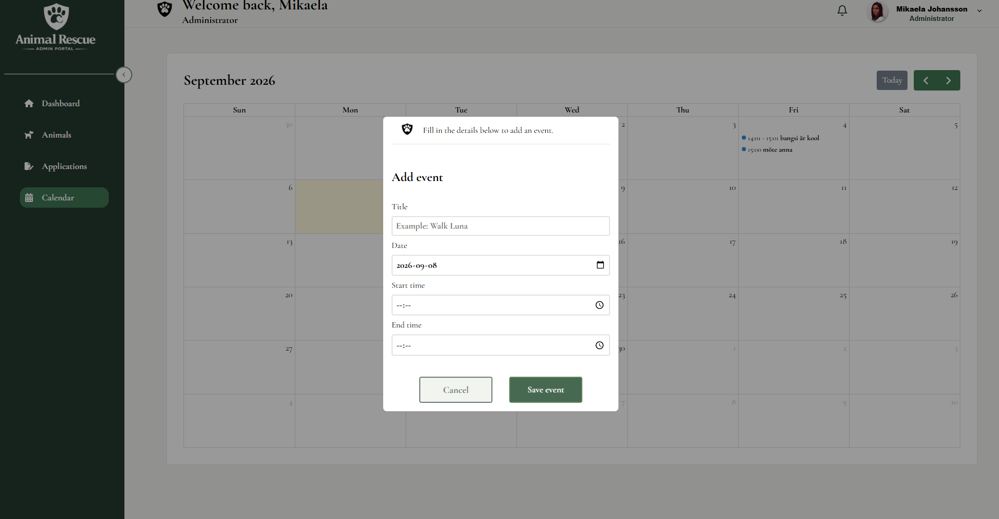
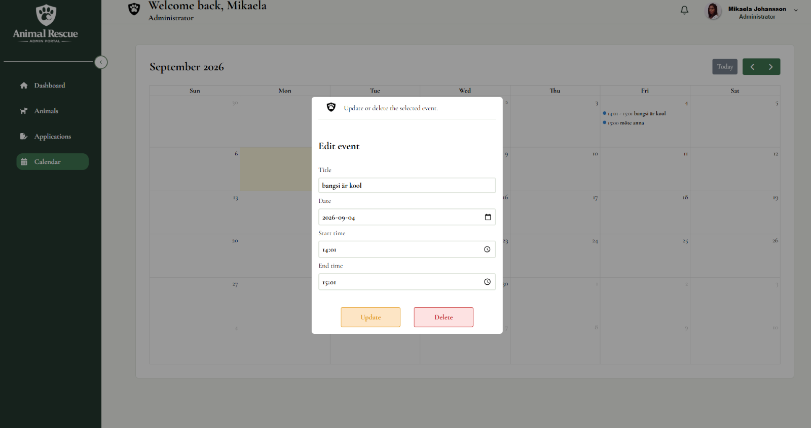

# 🐶 Animal Rescue Admin

A role-based administration system for animal rescue organizations, built with React and Firebase.

Animal Rescue Admin simulates the internal workflows of an animal rescue organization. Administrators, managers, veterinarians, staff and volunteers have different responsibilities, permissions and available actions within the same application.

The project goes beyond basic CRUD functionality by connecting features into workflows. Adoption applications move between different roles, medical status changes can notify veterinarians, new animals generate notifications for relevant users, and each user has access to their own calendar.

> ⚠️ This is an actively developed portfolio project. Core functionality is implemented, while automated testing, loading states and additional improvements are still in progress.

---

## 🌐 Live Demo

**Live application:**  
https://animal-rescue-admin.web.app

---

## 🎯 Project Overview

The main idea behind Animal Rescue Admin is to build connected workflows where information can move through different stages of an organization instead of creating isolated pages and CRUD features.

One example is the adoption workflow. An Administrator can process an incoming adoption application and move it forward for review. The Manager is then notified and can review and approve the application.

The related animal and application remain connected throughout the workflow.

The system also separates responsibilities between different user roles. Administrators manage animals and applications, Managers handle final adoption approval, Veterinarians manage medical information, while Staff and Volunteers have access based on their responsibilities.

Real-time notifications connect these workflows and help direct information to the users who need it.

---

## ✨ Key Features

### 🔐 Authentication & Role-Based Access Control

The application uses Firebase Authentication together with **Role-Based Access Control (RBAC)**.

Five user roles are currently represented:

- Administrator
- Manager
- Veterinarian
- Staff
- Volunteer

The authenticated user's role determines which routes, navigation items, views and actions are available.

Authorization is handled at multiple levels:

- UI permissions determine which actions and navigation items are displayed.
- Protected routes prevent access to unauthorized views.
- Firestore Security Rules protect the underlying data independently of the UI.

This means that hiding an action in the React interface is not treated as sufficient security. Database operations are also restricted by Firestore Security Rules.

---

## 👥 User Roles

| Role | Main responsibilities |
| --- | --- |
| **Administrator** | Manages animals and processes adoption applications |
| **Manager** | Reviews and approves adoption applications and has an overview of shelter activity |
| **Veterinarian** | Reviews animals and manages medical information |
| **Staff** | Views animal and adoption information needed for daily shelter operations |
| **Volunteer** | Has limited read access and manages their own schedule |

The application intentionally behaves differently depending on which user is authenticated.

For example, a Veterinarian can edit medical information without receiving permission to edit the animal's general administrative information, while final adoption approval belongs to the Manager rather than the Administrator.

---

## 🐕 Animal Management

Administrators can manage animal records in the system.

Current functionality includes:

- Add new animals
- Edit animal information
- Delete animals
- View detailed animal profiles
- Manage animal status
- Search animals by name or breed
- Filter animals by status
- Filter animals by gender
- Store animal history and notes
- View medical information
- Track vaccination and neutering status

Medical information has separate permissions from general animal management.

Veterinarians can update medical notes without receiving access to edit the animal's general administrative data.

---

## 🩺 Medical Workflow

Medical responsibilities are connected to the notification system.

When an Administrator changes an animal's status to **Medical Hold**:

1. The animal is updated.
2. The application identifies the Veterinarian user.
3. A notification is created in Cloud Firestore.
4. The Veterinarian receives the notification in real time.
5. Clicking the notification opens the relevant animal profile.
6. The notification is marked as read.

This keeps administrative and medical responsibilities separate while allowing information to move between the roles.

---

## 🏠 Adoption Workflow

The adoption functionality demonstrates how an application can move through multiple roles in the same system.

An Administrator can process an adoption application and move it to **In Review**.

When this happens:

1. The application status is changed.
2. A notification is created for the Manager.
3. The Manager receives the notification in real time.
4. The notification links directly to the relevant application.
5. The Manager can review and approve the adoption.
6. The related animal's demo status is updated to reflect the approved adoption.

Final adoption approval belongs to the Manager role rather than the Administrator role.

---

## 🔔 Real-Time Notifications

The application includes role-based real-time notifications powered by Cloud Firestore.

Notifications are created when important workflow events occur and are delivered to the users who need to know about or act on the event.

Current notification workflows include:

- **Medical Hold** → the Veterinarian is notified.
- **Adoption ready for review** → the Manager is notified.
- **New animal added** → Manager, Staff, Veterinarian and Volunteer users are notified.

Each notification stores the recipient together with information about the event and the related animal or adoption application.

The Topbar listens for notifications belonging to the authenticated user using a Firestore real-time listener.

Unread notifications appear in the notification menu. When a notification is opened, it is marked as read and the user is navigated directly to the relevant animal or adoption application.

---

## 📅 Personal Calendar

Authenticated users have access to their own calendar.

Calendar events are connected to the authenticated user's Firebase UID, allowing each user to maintain an individual schedule.

Users can:

- Create calendar events
- View their own events
- Update their own events
- Delete their own events
- View today's scheduled events from the Dashboard

Firestore Security Rules restrict calendar data so authenticated users can only access events belonging to their own account.

---

### 📊 Dashboard

The Dashboard provides a quick overview of the shelter and the user's schedule for the day.

Summary cards display key information such as the total number of animals and animals by status, including adopted animals. The cards also work as shortcuts, clicking a card opens the relevant view with the corresponding animal filter already applied.

The Dashboard also includes:

- **Recently added animals** — displays the latest animals added to the system. Clicking an animal opens its details page.
- **Today's events** — displays the logged-in user's calendar events for the current day. Events can be opened directly from the Dashboard.
- **Summary cards** — provide an at-a-glance overview while also acting as navigation to relevant filtered views.

This makes the Dashboard a starting point for both getting an overview and quickly navigating to relevant information in the system.

---

## 🧪 Try the Role-Based Workflows

The demo is designed to be explored with different user roles.

Switching between accounts is important because each role intentionally has different permissions and responsibilities.

### Medical Hold Workflow

1. Log in as **Administrator**.
2. Open an animal and change its status to `Medical Hold`.
3. Log out.
4. Log in as **Veterinarian**.
5. Open the notification menu.
6. A notification about the animal will be available.
7. Click the notification to navigate directly to the animal profile.

### Adoption Review Workflow

1. Log in as **Administrator**.
2. Open an adoption application.
3. Change its status to `In Review`.
4. Log out.
5. Log in as **Manager**.
6. Open the notification menu.
7. Open the review notification.
8. The Manager can review and complete the approval workflow.

### New Animal Workflow

1. Log in as **Administrator**.
2. Add a new animal.
3. Log out.
4. Log in as **Manager**, **Staff**, **Veterinarian** or **Volunteer**.
5. A notification about the new animal will be available.
6. Click the notification to navigate directly to the newly created animal.

---

## 🔑 Demo Accounts

The application includes five demo accounts representing the different user roles:

| Demo user | Role |
| --- | --- |
| Mikaela | Administrator |
| Stig | Manager |
| Tommy | Veterinarian |
| Karin | Staff |
| Bella | Volunteer |

No credentials need to be entered manually.

On the login page, select one of the demo users to automatically fill in the login credentials, then click **Login**.

Switching between the demo accounts is encouraged, as each role has different permissions, available actions and notification workflows.

---

## 🧪 Reusable Demo Data

The adoption applications currently included in the project are demo data.

Parts of the adoption workflow intentionally use `sessionStorage` for status changes rather than permanently modifying the original demo applications.

This is a deliberate choice for the current portfolio version of the application.

The public-facing application that will eventually create new adoption applications has not been built yet. If every visitor permanently changed the existing demo applications, the base data needed to demonstrate and test the workflow could eventually be lost or left in a completed state.

Using session-based status overrides allows visitors to test the workflow while keeping the original adoption demo data reusable for future visitors.

When the public-facing side of the project is implemented, the goal is for real submitted adoption applications and their workflow state to be persisted in the backend.

---

## 🖼️ Image Handling

Animal images are currently bundled with the frontend application and deployed together with the application to Firebase Hosting.

Firestore stores an image identifier with each animal record rather than storing the image file itself. The React application uses that identifier to map each animal to the corresponding bundled image.

This is an intentional choice for the current portfolio demo to keep the project within Firebase's free usage limits and avoid unnecessary cloud storage costs.

In a production application where users need to upload new images dynamically, image files would instead be handled by a dedicated storage solution such as Firebase Storage.

---

## 🔒 Security

Authentication and authorization are treated as separate responsibilities in the application.

**Authentication** answers:

> Who is the user?

Firebase Authentication handles user authentication and provides the authenticated user's UID.

**Authorization** answers:

> What is this user allowed to do?

The application uses the user's role together with centralized permissions to determine which functionality is available.

Security is handled through:

- Firebase Authentication
- Role-Based Access Control (RBAC)
- Centralized role permissions
- Protected React routes
- Firestore Security Rules
- User-specific calendar access
- User-specific notification access
- Separate permissions for administrative and medical data

Firestore Security Rules provide database-level protection independently of what is visible in the React interface.

---

## 🔭 Future Vision

The long-term goal is to extend the project into a small connected ecosystem for an animal rescue organization.

The current Animal Rescue Admin application represents the **internal administration side**.

A future public-facing application would represent the **adopter side**.

Visitors would be able to:

1. Browse animals available for adoption.
2. Select an animal.
3. Submit an adoption application.
4. Have that application enter the administration system.
5. Allow an Administrator to process the application.
6. Forward it to a Manager for final review and approval.
7. Connect the completed adoption back to the relevant animal.

The intended end-to-end flow is:

```text
Public animal rescue website
        ↓
Browse available animals
        ↓
Select an animal
        ↓
Submit adoption application
        ↓
Application enters Animal Rescue Admin
        ↓
Administrator processes application
        ↓
Manager receives notification
        ↓
Manager reviews and approves
        ↓
Animal adoption status is updated
```

The public-facing application has not yet been implemented, and the final backend integration for that application will be designed when that part of the project is developed.

The goal is to demonstrate how multiple frontend workflows, user roles and shared data can eventually work together as one connected system while keeping the implementation appropriate for a junior frontend portfolio project.

---

## 📸 Application Preview

### Login


---

### Dashboard


---

### Animals


---

### add_Animal



---

### Animal Details



---

### Adoption application



---

### Adoption details



---

### Calendar



---

### Calendar add



---

### Calendar update



---

## 🛠 Tech Stack

### Frontend

- React 19
- React Router
- JavaScript (ES6+)
- CSS Modules
- Vite

### Backend & Data

- Firebase Authentication
- Cloud Firestore
- Firestore Security Rules

### Libraries

- FullCalendar
- Lucide React Icons
- React Icons

### Deployment

- Firebase Hosting

---

## 📁 Project Structure

```text
src/
│
├── assets/
├── components/
├── config/
├── Data/
├── pages/
├── styles/
├── firebase.js
└── App.jsx
```

The application is organized into reusable components, page-level views and centralized configuration such as role permissions.

---

## 🧠 Technical Concepts Used

The project includes practical implementation of:

- React state management with hooks
- Component-based architecture
- Conditional rendering
- Role-Based Access Control (RBAC)
- Protected routing
- Firebase Authentication
- Firestore queries
- Firestore CRUD operations
- Real-time Firestore listeners
- Firestore Security Rules
- User-specific data
- Role-specific workflows
- Event-driven notifications
- Client-side session storage for reusable demo workflows
- Responsive layouts
- Reusable React components

---

## 🚀 Installation

Clone the repository:

```bash
git clone https://github.com/MikaelaJohansson/animal-rescue-admin.git
```

Move into the project:

```bash
cd animal-rescue-admin
```

Install dependencies:

```bash
npm install
```

Start the development server:

```bash
npm run dev
```

---

## 🔄 Project Status

### Implemented

- ✅ Firebase Authentication
- ✅ Protected routes
- ✅ Role-Based Access Control
- ✅ Firestore Security Rules
- ✅ Animal management
- ✅ Role-specific animal permissions
- ✅ Medical workflow
- ✅ Adoption workflow
- ✅ Personal calendar
- ✅ Role-based real-time notifications
- ✅ Responsive application layout

### Currently Being Improved

- 🔄 Loading states and skeleton UI
- 🔄 Automated testing
- 🔄 Additional UI and accessibility improvements

### Future Development

- Public-facing animal rescue website
- Public adoption application flow
- Integration between the public application and admin system
- Expanded reporting
- Dashboard visualizations
- Additional shelter-management workflows

---

## 👩‍💻 Author

**Mikaela Johansson**  
Frontend Developer

LinkedIn: www.linkedin.com/in/mikaela-johansson-6a59b82a5