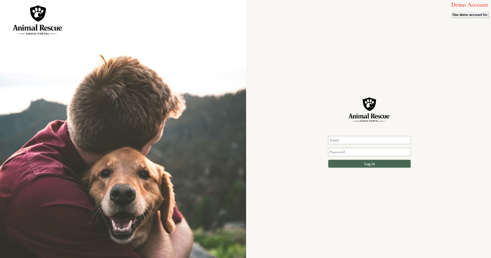
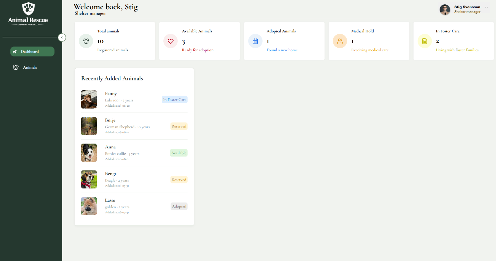
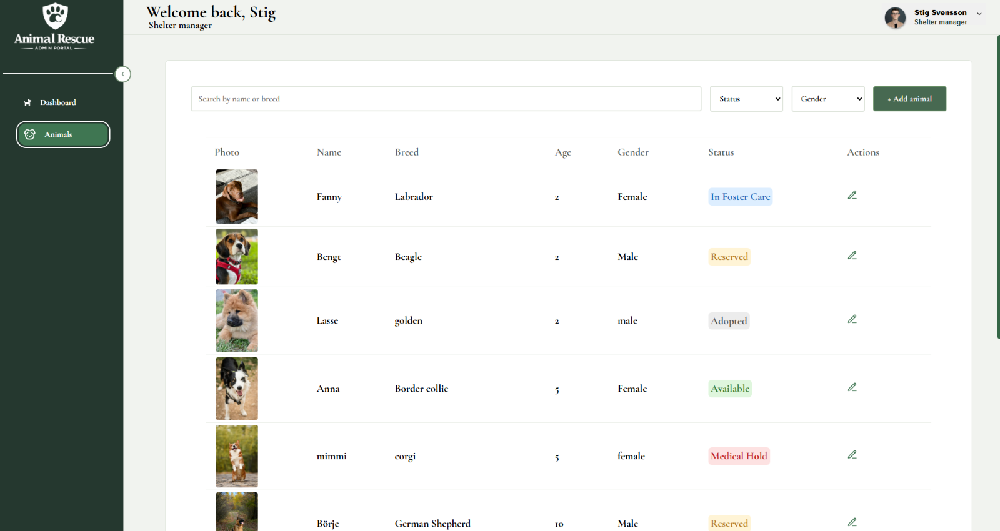
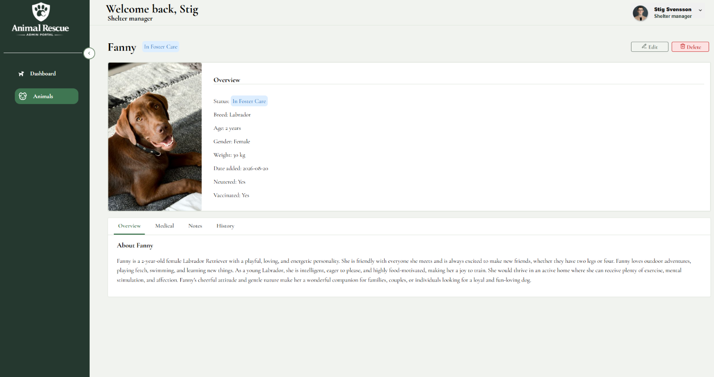

# 🐶 Animal Rescue Admin

A modern admin dashboard built with React and Firebase for animal rescue organizations.

The application helps staff manage rescue dogs, keep track of their medical information, and organize the daily workflow through a clean, responsive, and easy-to-use interface.

> ⚠️ This project is under active development and new features are continuously being added.

---

## ✨ Features

Current functionality includes:

- Secure Firebase Authentication
- Protected Routes
- Dashboard with live statistics
- Animal Management (CRUD)
- Add new animals
- Edit existing animals
- Delete animals
- Detailed animal profiles
- Animal status management
- Search animals by name or breed
- Filter by status
- Filter by gender
- Responsive design
- Reusable React components
- Local image library (Firebase Storage is intentionally not used)

---

## 📸 Application Preview

### Login



---

### Dashboard



---

### Animals



---

### Animal Details



---

## 🛠 Tech Stack

### Frontend

- React 19
- React Router
- JavaScript (ES6+)
- CSS Modules
- Vite

### Backend

- Firebase Authentication
- Cloud Firestore

### Other

- Lucide React Icons
- React Icons

---

## 📁 Project Structure

```text
src/
│
├── assets/
├── components/
├── Data/
├── pages/
├── styles/
├── firebase.js
└── App.jsx
```

---

## 🚀 Installation

Clone the repository

```bash
git clone https://github.com/MikaelaJohansson/animal-rescue-admin.git
```

Install dependencies

```bash
npm install
```

Start development server

```bash
npm run dev
```

---

## 🎯 Project Goals

The goal of this project is to simulate a real-world administration system that could be used by an animal rescue organization.

The focus has been on building a clean component architecture while learning modern React development and Firebase.

---

## 🔄 Future Improvements

Planned features include:

- Adoption management
- Calendar
- Notifications
- Activity log
- User roles & permissions
- Reports
- Dashboard charts
- Better search and filtering
- Mobile improvements
- Dark mode

---

## 🤖 Development Approach

This project has been developed by me as a personal portfolio project.

AI tools have been used as a learning aid for explanations and problem solving when I got stuck. The application architecture, implementation, UI decisions, and continuous development have been carried out by me.

---

## 📌 Status

✅ Actively maintained

The project will continue to evolve with new functionality and improvements over time.

---

## 👩‍💻 Author

**Mikaela Johansson**

Frontend Developer

LinkedIn: *www.linkedin.com/in/mikaela-johansson-6a59b82a5*


