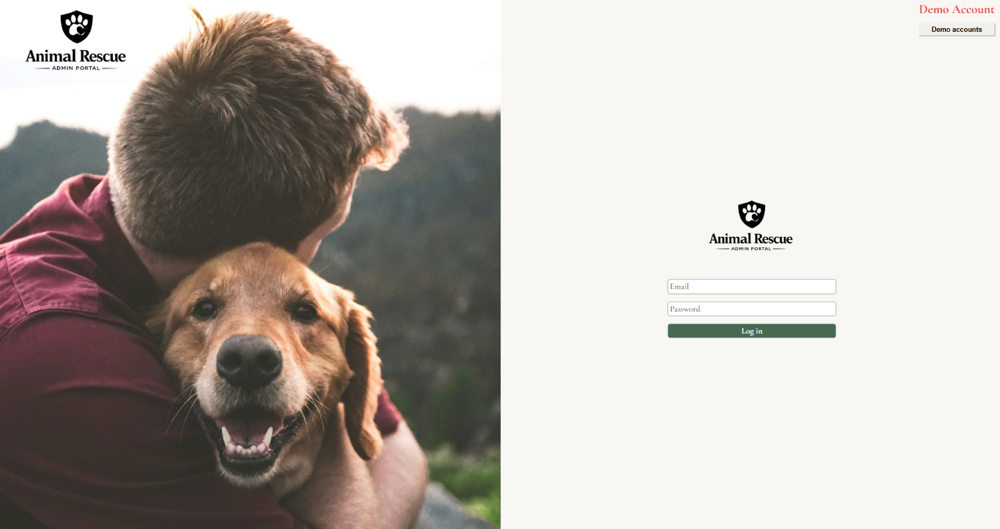
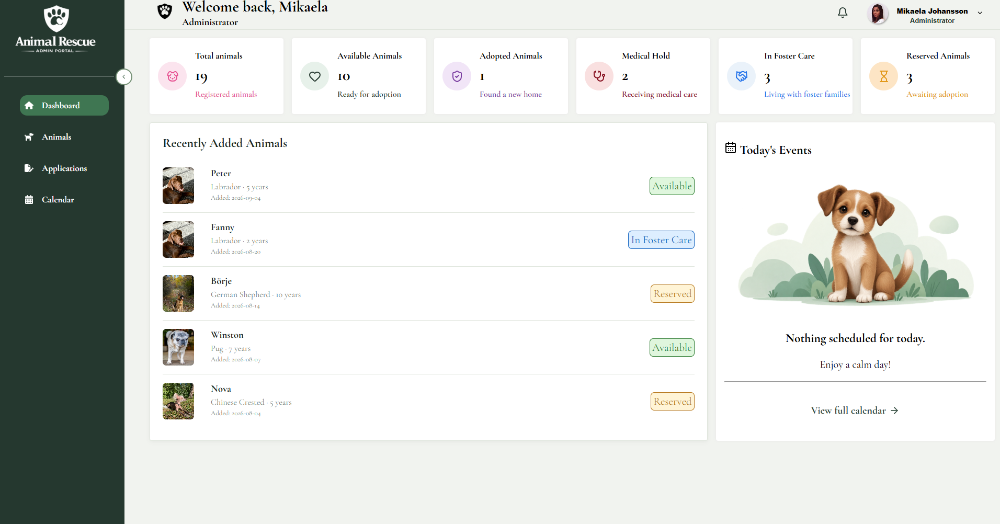
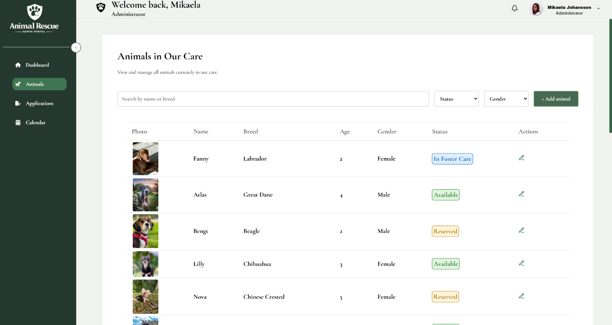
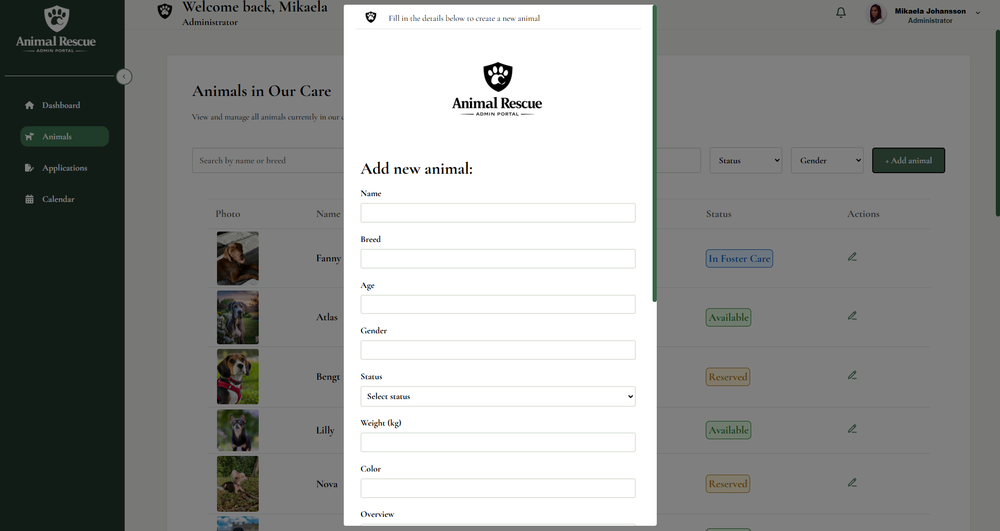
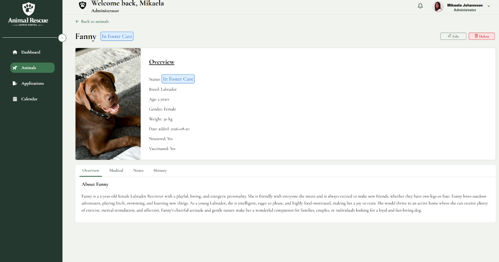
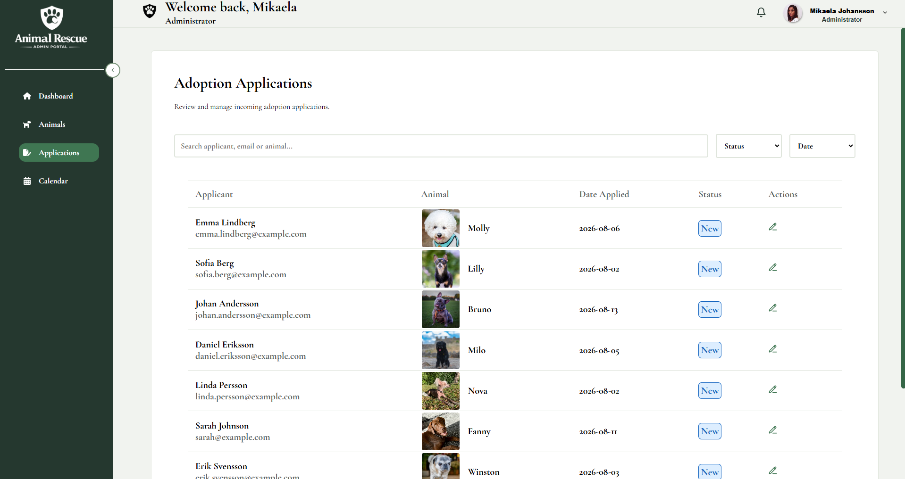
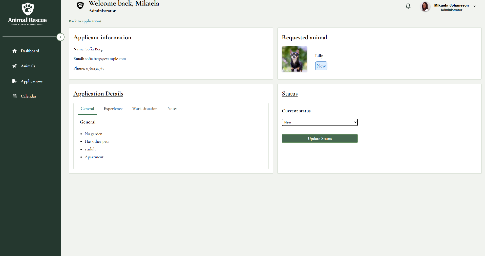
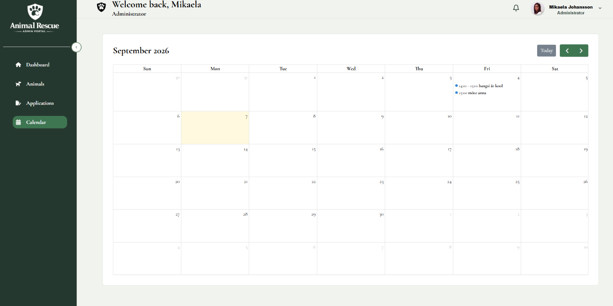
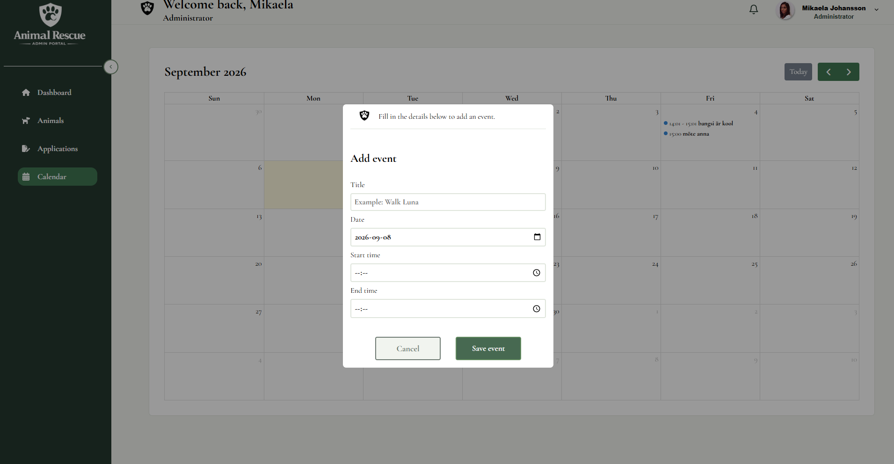
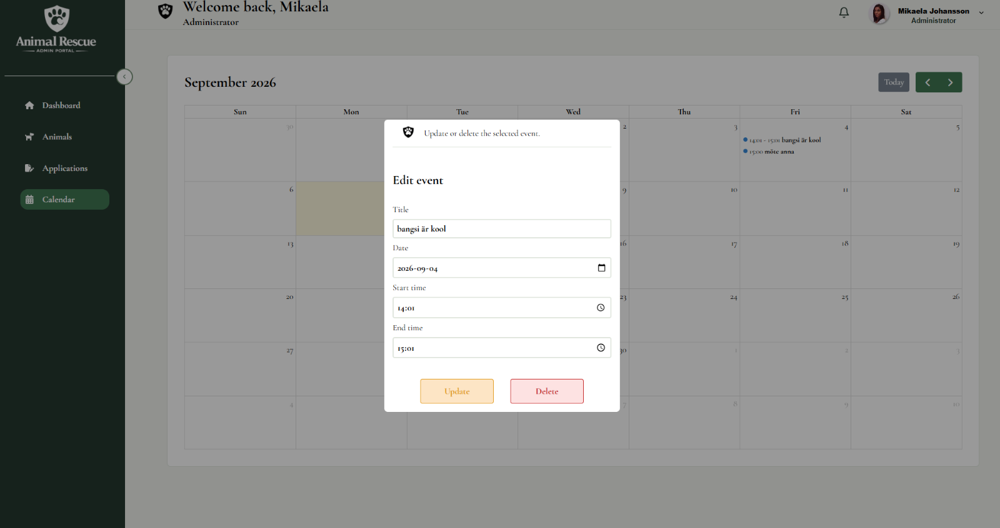

# 🐶 Animal Rescue System

A connected animal rescue platform built with React and Firebase, consisting of an internal role-based administration system and a public-facing adoption website.

The project simulates the workflow of an animal rescue organization — from adding a new dog to the system, displaying it on the public website, receiving an adoption application, processing the application internally, and completing the adoption.

Both applications use the same Cloud Firestore database. Shared animal and adoption data therefore moves between the public and administrative sides of the system.

The project goes beyond isolated CRUD functionality by connecting animals, adoption applications, user roles, permissions, status changes and real-time notifications into complete workflows.

> ⚠️ This is an actively developed portfolio project. The core system and end-to-end workflows are implemented, while automated testing, accessibility and additional improvements are still in progress.

---

## 🌐 Live Applications

### Admin Application

**Live application:**

https://animal-rescue-admin.web.app

### Public Application

**Live application:**

PUBLIC_APP_URL

The public application is implemented and ready for deployment. The link above will be updated with the deployed application URL.

---

## 🎯 Project Overview

Animal Rescue consists of two separate React applications connected to the same Firebase backend.

### Animal Rescue Admin

The internal administration system used to manage animals, adoption applications and shelter workflows.

It includes:

- Firebase Authentication
- Role-Based Access Control
- Animal management
- Adoption application management
- Medical workflows
- Real-time notifications
- Personal calendars
- Dashboard statistics
- Role-specific permissions
- Protected routes
- Firestore Security Rules

### Animal Rescue Public

The public-facing website used by potential adopters.

Visitors can:

- Browse rescue dogs
- Search and filter dogs
- View individual dog profiles
- Read about the adoption process
- Submit an adoption application for a specific dog

The two applications share animal and adoption data through Cloud Firestore.

This means the public website is not a separate static demonstration. Actions performed in one part of the system can affect what is displayed or processed in the other.

---

## 🔄 End-to-End Adoption Workflow

One of the main goals of the project is to demonstrate how data can move through an entire system instead of creating isolated pages and CRUD operations.

The workflow can begin when an Administrator creates a new dog in the Admin application.

```text
Administrator creates a new dog
        ↓
Dog is stored in Cloud Firestore
        ↓
Dog becomes available in Admin and Public
        ↓
Visitor opens the Public application
        ↓
Visitor selects a dog
        ↓
Visitor submits an adoption application
        ↓
Application is stored in Cloud Firestore
        ↓
Administrator receives a real-time notification
        ↓
Administrator reviews the application
        ↓
Administrator changes status to In Review
        ↓
Manager receives a real-time notification
        ↓
Manager reviews the application
        ↓
Manager approves the adoption
        ↓
Application status becomes Approved
        ↓
Dog status becomes Adopted
        ↓
Updated dog status is reflected across the system
```

The animal and its adoption application remain connected through the workflow.

Because both applications use the same Firestore data, the animal does not need to be manually recreated or maintained separately in each application.

---

## 🔐 Authentication & Role-Based Access Control

The Admin application uses Firebase Authentication together with **Role-Based Access Control (RBAC)**.

Five user roles are represented:

- Administrator
- Manager
- Veterinarian
- Staff
- Volunteer

The authenticated user's role determines which routes, navigation items, views and actions are available.

Authorization is handled at multiple levels:

- UI permissions determine which actions and navigation items are displayed.
- Protected routes prevent users from accessing unauthorized views.
- Firestore Security Rules restrict database operations independently of the React interface.

This means that hiding a button or route in the frontend is not treated as sufficient security.

The backend also validates which data each role is allowed to modify.

---

## 👥 User Roles

| Role | Main responsibilities |
| --- | --- |
| **Administrator** | Creates and manages animals and processes adoption applications |
| **Manager** | Reviews adoption applications and performs final adoption approval |
| **Veterinarian** | Manages medical information and completes Medical Hold workflows |
| **Staff** | Has read access to animal and adoption information needed for shelter operations |
| **Volunteer** | Has limited read access and manages their own schedule |

The application intentionally behaves differently depending on which user is authenticated.

An Administrator has general administrative control over animal records but cannot edit medical history.

A Veterinarian can edit medical information and perform specific medical status changes without receiving permission to edit the animal's general administrative information.

Final adoption approval belongs to the Manager rather than the Administrator.

This separation of responsibilities is enforced both in the interface and through Firestore Security Rules.

---

## 🐕 Animal Management

Administrators manage the general animal records in the system.

Current functionality includes:

- Add new animals
- Edit animal information
- Delete animals
- View detailed animal profiles
- Manage animal status
- Search animals by name or breed
- Filter animals by status
- Filter animals by gender
- Store animal history and notes
- View medical information
- Track vaccination status
- Track neutering status

When an Administrator creates a new animal, the animal is stored in Cloud Firestore.

Because the Admin and Public applications use the same animal data, the animal can then be displayed in both applications.

Administrators retain control over the animal's general information and status throughout its lifecycle.

For example, when an approved adoption changes a dog's status to **Adopted**, the Administrator can still edit the animal record later and change its status if circumstances change.

The same principle applies to statuses such as:

- Available
- Reserved
- Adopted
- In Foster Care
- Medical Hold

Medical information is handled separately through role-based permissions.

Administrators can view medical history but cannot edit it.

Veterinarians can edit medical information without receiving permission to edit the animal's general administrative data.

---

## 🩺 Medical Hold Workflow

The project includes a role-based medical workflow connecting the Administrator and Veterinarian.

The Administrator initiates the workflow when an animal requires medical attention.

```text
Administrator
        ↓
Changes animal to Medical Hold
        ↓
Veterinarian receives notification
        ↓
Veterinarian opens the animal
        ↓
Reviews / updates medical information
        ↓
Changes Medical Hold → Available
        ↓
Administrator receives notification
        ↓
Animal is available again
```

The workflow works as follows:

1. An Administrator changes an animal's status to **Medical Hold**.
2. The Veterinarian receives a real-time notification that an animal requires medical attention.
3. The notification links directly to the affected animal.
4. The Veterinarian can review and update the animal's medical notes.
5. The Veterinarian does not receive permission to edit the animal's general administrative information.
6. When treatment is completed, the Veterinarian can change the animal's status from **Medical Hold** back to **Available**.
7. The Administrator receives a real-time notification confirming that the Medical Hold has been completed.

The Veterinarian cannot independently move a normal animal into Medical Hold through the medical workflow.

Starting the Medical Hold belongs to the Administrator, while completing it belongs to the Veterinarian.

This creates a two-way workflow where permissions, status changes and notifications connect two different roles.

---

## 🏠 Adoption Management

Adoption applications submitted through the Public application are stored in Cloud Firestore and enter the Animal Rescue Admin workflow.

The process is connected to the specific dog selected by the visitor.

When a visitor applies to adopt a dog:

1. The visitor selects a dog in the Public application.
2. The visitor opens the adoption form.
3. The visitor submits an adoption application.
4. The application is stored in Cloud Firestore.
5. The application is connected to the selected animal.
6. The Administrator receives a real-time notification about the new application.
7. The Administrator opens and reviews the application.
8. The Administrator can move the application to **In Review**.
9. The Manager receives a real-time notification.
10. The Manager opens and reviews the application.
11. The Manager can approve the adoption.
12. The application status becomes **Approved**.
13. The related animal's status becomes **Adopted**.
14. The updated animal status is reflected across the system.

Final adoption approval belongs to the Manager role.

The Administrator still retains general administrative control over the animal record after the workflow is completed.

For example, if circumstances later change, the Administrator can edit the animal and update its status again.

Adoption applications and their workflow state are persisted in Cloud Firestore.

The adoption workflow does not rely on browser session storage.

---

## 🔔 Real-Time Notifications

The Admin application includes role-based real-time notifications powered by Cloud Firestore.

Notifications connect different users to events that require their attention.

Current notification workflows include:

- **New adoption application** → the Administrator is notified when an application is submitted through the Public application.
- **Adoption ready for review** → the Manager is notified when an Administrator moves an application to In Review.
- **Medical attention required** → the Veterinarian is notified when an Administrator places an animal on Medical Hold.
- **Medical Hold completed** → the Administrator is notified when the Veterinarian returns an animal to Available.
- **New animal added** → relevant shelter users are notified when an Administrator creates a new animal.

Notifications contain information about the event and the related animal or adoption application.

The Topbar listens for notifications belonging to the authenticated user using a Firestore real-time listener.

Unread notifications appear in the notification menu.

When a notification is opened:

1. The notification is marked as read.
2. The user is navigated to the relevant animal or adoption application.

This allows notifications to work as part of the workflow rather than only displaying informational messages.

---

## 🌐 Public Adoption Application

Animal Rescue Public represents the adopter-facing side of the project.

It is a separate React application connected to the same Firebase project and Cloud Firestore data used by Animal Rescue Admin.

Visitors can:

- Browse rescue dogs
- Search dogs by name or breed
- Filter dogs by age
- Filter dogs by gender
- Filter dogs by status
- View individual dog profiles
- Read about the adoption process
- Submit an adoption application for a specific dog

The public website also includes informational sections about supporting rescue dogs and animal welfare organizations.

When a visitor submits an adoption application, the application is stored in Firestore and enters the internal Admin workflow.

This connects the public user experience directly to the shelter's internal administration system.

---

## 🔗 Shared Data Between Applications

Animal Rescue Admin and Animal Rescue Public are separate React applications but use the same Firebase backend.

This creates a shared data flow between the public and administrative interfaces.

For example:

```text
ADMIN APPLICATION
Administrator creates dog
        ↓
CLOUD FIRESTORE
Stores animal
        ↓
PUBLIC APPLICATION
Displays dog
        ↓
Visitor submits adoption application
        ↓
CLOUD FIRESTORE
Stores application
        ↓
ADMIN APPLICATION
Administrator receives application
        ↓
Administrator sends application for review
        ↓
Manager approves
        ↓
CLOUD FIRESTORE
Animal becomes Adopted
        ↓
ADMIN + PUBLIC
Updated animal status is available to both applications
```

This allows the two interfaces to serve different users while operating on shared underlying data.

---

## 📅 Personal Calendar

Authenticated Admin users have access to their own calendar.

Calendar events are connected to the authenticated user's Firebase UID, allowing each user to maintain an individual schedule.

Users can:

- Create calendar events
- View their own events
- Update their own events
- Delete their own events
- View today's scheduled events from the Dashboard

Firestore Security Rules restrict calendar data so authenticated users can only access events belonging to their own account.

---

## 📊 Dashboard

The Dashboard provides a quick overview of shelter activity and the authenticated user's schedule.

Summary cards display information such as:

- Total animals
- Available animals
- Adopted animals
- Animals grouped by relevant status

The cards also work as navigation shortcuts.

Clicking a card opens the relevant animal view with the corresponding filter already applied.

The Dashboard also includes:

- **Recently added animals** — displays the latest animals added to the system. Clicking an animal opens its details page.
- **Today's events** — displays the logged-in user's calendar events for the current day.
- **Summary cards** — provide an overview while also acting as shortcuts to filtered animal views.

This makes the Dashboard both an overview and a starting point for navigating the system.

---

## 💀 Skeleton Loading States

The Admin application uses skeleton loading states while data is being fetched asynchronously from Cloud Firestore.

Instead of displaying empty content during asynchronous operations, skeleton layouts reflect the structure of the page until the requested data is available.

Skeleton loading is implemented across the main data-driven views, including:

- Dashboard
- Animal views
- Animal details
- Adoption applications
- Adoption details
- Calendar

---

## 🧪 Try the Complete Adoption Workflow

The project is designed to demonstrate how the two applications work together.

### Step 1 — Create a Dog

1. Open **Animal Rescue Admin**.
2. Log in as **Administrator**.
3. Add a new dog.
4. The dog is stored in Cloud Firestore.

### Step 2 — View the Dog Publicly

1. Open **Animal Rescue Public**.
2. Navigate to the dog listing.
3. Find the newly created dog.
4. Open the dog's details page.

### Step 3 — Submit an Adoption Application

1. Start an adoption application for the dog.
2. Complete the adoption form.
3. Submit the application.
4. The application is stored in Cloud Firestore.

### Step 4 — Administrator Review

1. Return to **Animal Rescue Admin**.
2. Log in as **Administrator**.
3. Open the notification menu.
4. Open the new adoption application notification.
5. Review the application.
6. Change the application status to **In Review**.

### Step 5 — Manager Approval

1. Log out.
2. Log in as **Manager**.
3. Open the notification menu.
4. Open the adoption review notification.
5. Review the application.
6. Approve the adoption.

The application becomes **Approved** and the related dog's status becomes **Adopted**.

Because the applications share Firestore data, the updated animal status is available across the system.

---

## 🩺 Try the Medical Hold Workflow

1. Log in as **Administrator**.
2. Open an animal.
3. Change the animal's status to **Medical Hold**.
4. Log out.
5. Log in as **Veterinarian**.
6. Open the notification menu.
7. Open the medical attention notification.
8. The notification navigates directly to the relevant animal.
9. Update the animal's medical notes.
10. When treatment is completed, change the status from **Medical Hold** to **Available**.
11. Log out.
12. Log in as **Administrator**.
13. Open the notification menu.
14. A notification confirms that the animal has been returned to **Available**.

The workflow intentionally separates responsibilities:

**Administrator:**

```text
Animal → Medical Hold
```

**Veterinarian:**

```text
Medical Hold → Available
```

---

## 🐕 Try the New Animal Workflow

1. Log in as **Administrator**.
2. Add a new animal.
3. The animal is stored in Cloud Firestore.
4. The animal becomes available to both applications.
5. Other relevant shelter users receive a notification about the new animal.
6. The notification can be opened to navigate directly to the new animal.

---

## 🔑 Demo Accounts

The Admin application includes five demo accounts representing the different user roles:

| Demo user | Role |
| --- | --- |
| Mikaela | Administrator |
| Stig | Manager |
| Tommy | Veterinarian |
| Karin | Staff |
| Bella | Volunteer |

No credentials need to be entered manually.

On the login page, select one of the demo users to automatically fill in the login credentials, then click **Login**.

Switching between demo accounts is encouraged because each role intentionally has different permissions, available actions and responsibilities.

---

## 🔒 Firestore Security

Authentication and authorization are treated as separate responsibilities.

### Authentication

Authentication answers:

> Who is the user?

Firebase Authentication handles user authentication and provides the authenticated user's UID.

### Authorization

Authorization answers:

> What is this user allowed to do?

The application combines the authenticated user's role with centralized permissions and Firestore Security Rules.

Examples of database-level restrictions include:

- Only Administrators can create animals.
- Administrators can edit general animal information but cannot edit medical notes.
- Veterinarians can edit medical notes.
- Veterinarians can complete the Medical Hold workflow by changing an animal from Medical Hold to Available.
- Managers can approve an adoption by changing an application from In Review to Approved.
- Users can only manage their own calendar events.
- Users can only read their own notifications.
- Notification updates are restricted to read-state changes.
- Public visitors can submit adoption applications for available animals.

This means the application's security does not depend only on what buttons or pages are visible in React.

Firestore independently validates database operations.

---

## 🖼️ Image Handling

Animal images are currently bundled with the frontend applications.

Firestore stores an image identifier with each animal record rather than storing the image file itself.

The React applications use that identifier to map the animal to the corresponding bundled image.

This is an intentional choice for the current portfolio project to keep the implementation within Firebase's free usage limits and avoid unnecessary cloud storage costs.

In a production application where users need to upload images dynamically, the image files could instead be handled by a dedicated storage solution such as Firebase Storage.

---

## 🏗️ System Architecture

The project consists of two separate frontend applications connected to a shared Firebase backend.

```text
┌─────────────────────────────┐
│    Animal Rescue Public     │
│                             │
│  Browse dogs                │
│  Search & filtering         │
│  Dog details                │
│  Adoption process           │
│  Adoption form              │
└──────────────┬──────────────┘
               │
               │
               ▼
        ┌───────────────┐
        │   Firebase    │
        │               │
        │ Authentication│
        │ Firestore     │
        │ Security Rules│
        │ Analytics     │
        └───────┬───────┘
                │
                │
                ▼
┌─────────────────────────────┐
│     Animal Rescue Admin     │
│                             │
│  Animal management          │
│  Adoption applications      │
│  RBAC                       │
│  Notifications              │
│  Medical workflow           │
│  Calendar                   │
│  Dashboard                  │
└─────────────────────────────┘
```

The architecture allows the two interfaces to serve different users while sharing the same underlying data.

---

## 📸 Application Preview

### Login



---

### Dashboard



---

### Animals



---

### Add Animal



---

### Animal Details



---

### Adoption Application



---

### Adoption Details



---

### Calendar



---

### Calendar Add



---

### Calendar Update



---

## 🛠 Tech Stack

### Frontend

- React 19
- React Router
- JavaScript (ES6+)
- CSS Modules
- Vite

### Backend & Data

- Firebase Authentication
- Cloud Firestore
- Firestore Security Rules

### Libraries

- FullCalendar
- Lucide React Icons
- React Icons

### Deployment & CI/CD

- Firebase Hosting
- GitHub Actions

### Analytics

- Firebase Analytics
- Google Analytics

---

## 📁 Project Structure

```text
src/
│
├── assets/
├── components/
├── config/
├── Data/
├── pages/
├── styles/
├── firebase.js
└── App.jsx
```

The Admin application is organized into reusable components, page-level views and centralized configuration such as role permissions.

The Public application is maintained as a separate React application while sharing the same Firebase backend.

---

## 🧠 Technical Concepts Used

The project includes practical implementation of:

- React state management with hooks
- Component-based architecture
- Reusable React components
- Conditional rendering
- Responsive layouts
- CSS Grid and Flexbox
- Asynchronous data loading
- Skeleton loading states
- React Router
- Dynamic routes
- Role-Based Access Control (RBAC)
- Protected routes
- Firebase Authentication
- Cloud Firestore
- Firestore queries
- Firestore CRUD operations
- Real-time Firestore listeners
- Firestore Security Rules
- Shared data between separate React applications
- User-specific data
- Role-specific workflows
- Event-driven notifications
- Cross-application adoption workflow
- Persistent adoption applications
- Firebase Analytics
- CI/CD with GitHub Actions
- Firebase Hosting

---

## 🚀 Installation

Clone the Admin repository:

```bash
git clone https://github.com/MikaelaJohansson/animal-rescue-admin.git
```

Move into the project:

```bash
cd animal-rescue-admin
```

Install dependencies:

```bash
npm install
```

Start the development server:

```bash
npm run dev
```

---

## 🔄 Project Status

### Implemented

- ✅ Firebase Authentication
- ✅ Protected routes
- ✅ Role-Based Access Control
- ✅ Firestore Security Rules
- ✅ Animal management
- ✅ Role-specific animal permissions
- ✅ Medical Hold workflow
- ✅ Veterinarian medical permissions
- ✅ Adoption workflow
- ✅ Persistent Firestore adoption applications
- ✅ Public adoption form
- ✅ Public dog listing
- ✅ Public dog details
- ✅ Shared animal data between applications
- ✅ End-to-end Admin → Public → Admin adoption flow
- ✅ Manager adoption approval
- ✅ Automatic animal status update after adoption
- ✅ Personal calendar
- ✅ Role-based real-time notifications
- ✅ New adoption application notifications
- ✅ Medical workflow notifications
- ✅ Responsive application layouts
- ✅ Skeleton loading states
- ✅ Firebase Hosting for Admin
- ✅ CI/CD with GitHub Actions

### Currently Being Improved

- 🔄 Automated testing
- 🔄 Accessibility improvements
- 🔄 UI polish

### Deployment

- ✅ Animal Rescue Admin deployed
- 🔄 Animal Rescue Public ready for deployment

---

## 👩‍💻 Author

**Mikaela Johansson**  
Frontend Developer

LinkedIn: www.linkedin.com/in/mikaela-johansson-6a59b82a5